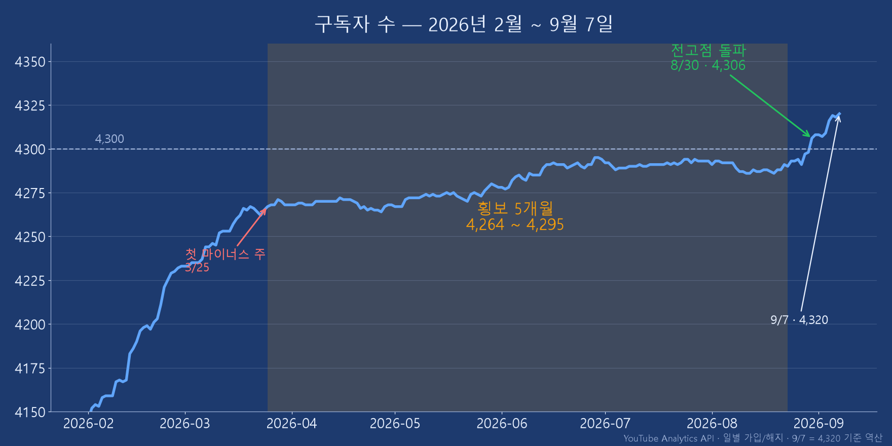
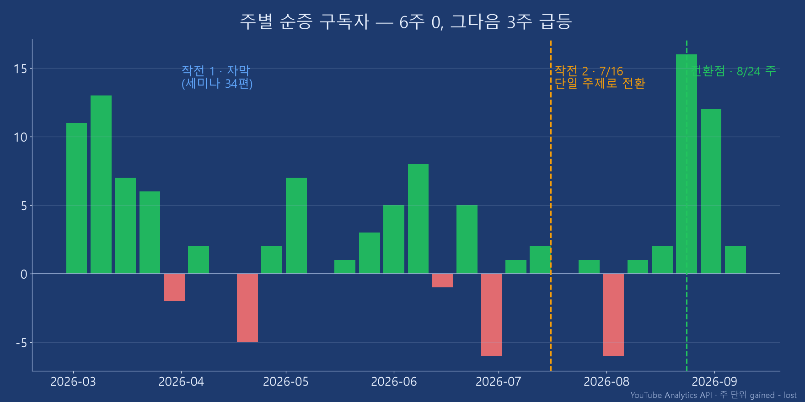
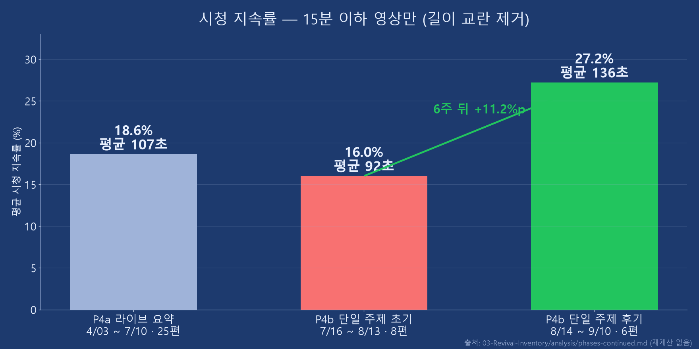

<!-- _class: lead -->

# 유튜브 채널 살리기, 석 달 뒤
## 사람이 병목이 아니라, 사람이 개입해야 퀄리티가 유지된다

**박창수 · Catch Up AI** · Builders Lounge 5차 모임 · 2026-09-16
지난 6/26 발표 「AI 시대의 크리에이터」 2편

<!--
(0:20) 6월 창발 발표 「AI 시대의 크리에이터」의 2편입니다. 석 달이 지났습니다. 오늘은 그 뒤에 무엇을 했고, 숫자가 어떻게 됐고, 그중 하나가 완전히 틀렸다는 얘기를 10분에 하겠습니다.
-->

---

## 0. 지난 발표가 멈춘 자리 — 6/26 의 마지막 표

| Phase | 개월 | 조회/월 | **신규 구독/월** | 비고 (6/26) |
|---|---:|---:|---:|---|
| P2 외부 기술 전달 | 12.4 | 5,751 | **+231** | 핵심 성장기 |
| P3 라이브 방송 | 10.8 | 4,730 | +125 | 전환 후 하락 |
| P4 AI 영상 제작 | 3.9 | 2,398 | **+18** | *"진행 중"* |
| **→ 최근 6주 (7/28~9/7)** | 1.4 | **4,320** | **+19** | 오늘 |

> 조회는 P3 수준으로 돌아왔다(1.80배). **구독은 아직 아니다.** 그 사이에 무엇이 있었나.

<!--
(0:35) 6월에 이 표로 끝냈습니다 — P4, AI 영상 제작, 월 18명, "진행 중". 석 달 뒤 마지막 줄을 붙였습니다. 조회는 라이브 시절 수준으로 돌아왔는데, 구독은 19명 — 거의 그대로입니다. 오늘 얘기는 이 한 줄 사이에 있었던 일입니다.
-->

---

## 1. 바닥 — 5개월 횡보, 그리고 마이너스

<!--
(0:50) 3월 25일 주에 처음 순증이 마이너스로 꺾였고, 그때부터 8월 말까지 4,264에서 4,295 사이를 5개월 왔다 갔다 했습니다. 지난 발표 때 "4,300을 못 넘고 있다"고 한 게 그대로 데이터에 있습니다. 라이브 방송 시절엔 한 달에 125명씩 늘던 채널이 18명으로 떨어진 상태였습니다.
-->

---

## 2. 그래서 두 가지를 바꿨다

| | 작전 1 · 자막 | 작전 2 · 단일 주제 |
|---|---|---|
| 언제 | 4월 ~ | **7월 16일 ~** |
| 무엇 | 세미나 녹화에 한국어 자막 · **34편** | 3시간 라이브 요약본을 **끊고**, 한 편에 주제 하나 |
| 왜 | 현장에 못 온 분께 | 요약본 조회 82 · 구독 1 (7/10, 마지막 편) |

> 그 전에 확인한 것 하나 — **Shorts 는 구독으로 이어지지 않는다 (52.2배 차이)**. 그래서 롱폼에 힘을 썼습니다.

<!--
(0:50) 두 가지를 바꿨습니다. 자막을 달아서 세미나 34편을 올렸고, 7월 16일부터는 3시간 라이브를 요약하던 영상을 끊고 한 편에 주제 하나만 다루는 영상으로 바꿨습니다. Shorts 는 아예 배제했습니다 — 조회는 나오는데 구독으로 이어지는 비율이 롱폼의 52분의 1이었습니다.
-->

---

## 3. 석 달 동안 87편 — 노력 대비, 그리고 언어

| 갈래 | 언어 | 편수 | 구독 | **편당 구독** |
|---|---|---:|---:|---:|
| AI 제작 (Remotion) | 🇰🇷 | 16 | 39 | **2.44** |
| 자체 행사 (Builders Lounge 등) | 🇰🇷 | 8 | 19 | **2.38** |
| AI 제작 — 같은 내용의 영어판 | 🇺🇸 | 14 | 7 | 0.50 |
| **세미나 녹화 + 한국어 자막** | 🇺🇸 | **34** | **3** | **0.09** |

- 한/영 짝 13쌍: 영어판 조회 **45%** · 구독 **24%** · 시청 국가 KR **74%**
- 영어판은 자란다 (첫 달 ≈20 → ≈85) — 그래도 비중은 **41% → 16%**
- 같은 영어끼리도 세미나는 AI 제작의 **1/5**

<!--
(1:00) 되살리기 구간 87편을 갈래와 언어로 나눴습니다. 먼저 언어 — 같은 내용을 한국어와 영어로 올린 13쌍에서 영어판은 조회가 절반, 구독은 4분의 1, 시청 국가는 74% 가 한국입니다. 아직 한국인 채널입니다. 영어판이 요즘 늘어나는 느낌이 있었는데 반은 맞았습니다 — 새 영어 영상의 첫 달 조회는 넉 달 새 4배가 됐습니다. 다만 한국어가 더 빨리 자라서 비중은 41% 에서 16% 로 줄었습니다. 그리고 세미나 — 영어 발표 녹화에 한국어 자막을 단 34편이 구독 3명입니다. 영어라서 그런가 했는데, 같은 영어 AI 제작 영상과 비교해도 5분의 1입니다. 가장 손이 많이 간 작업이 가장 적게 돌아왔습니다. 이건 검증한 가설은 아니고 관찰입니다 — 그 얘기는 Substack 에서.
-->

---

## 4. ⭐ 틀린 자리에서 진짜가 나왔다

**가설: "사람이 나오는 영상이 낫다"**

| | 1차 판정 (제목으로 분류) | 2차 판정 (제작 실물로 분류) |
|---|---|---|
| 편당 구독 | **1.71배** — 약하게 맞다 | **0.86배** — 차이 없다 |

- 제목 `AI in Action` 하나에 **3시간 방송 원본**과 **16분 AI 요약본**이 같이 들어 있었다
- 코드 한 줄 — `else:` — 가 2024년 강의까지 "AI 제작"으로 밀어 넣고 있었다
- **통계가 틀리는 자리는 데이터가 아니라 비교군**이다

<!--
(1:00) 여기가 오늘의 전환점입니다. "사람이 나오는 영상이 낫다"는 가설을 처음엔 제목으로 분류해서 1.71배, 약하게 맞다고 판정했습니다. 그런데 통 안을 열어 보니 같은 제목에 3시간 방송 원본과 16분 요약본이 섞여 있었고, 코드 한 줄이 2024년 강의까지 AI 제작으로 넣고 있었습니다. 실물로 다시 분류하니 0.86배 — 차이가 없었습니다. 판정이 뒤집힌 겁니다. 그리고 그 틀린 자리에서 진짜 축이 나왔습니다 — 사람이 나오느냐가 아니라, 사람이 얼마나 손봤느냐였습니다.
-->

---

## 5. 작전 2 의 효과 — 그리고 한계

| | 전환 전 · 라이브 요약 33편 | 전환 후 · 단일 주제 16편 | |
|---|---:|---:|---:|
| 편당 조회 | 63 | **148** | **2.36배** |
| 편당 구독 | 0.97 | 1.25 | 1.29배 |
| 구독 피드 유입 | 23회 | 73회 | 3.17배 |
| **유튜브 검색 유입** | 8.9회 | **6.8회** | **0.76배 ⬇** |

> 이미 구독한 분들이 더 보게 됐다. **새로 발견되지는 않았다.** → 작전 3 은 「발견」

<!--
(1:00) 단일 주제로 바꾼 효과는 분명했습니다 — 편당 조회 2.36배, 편당 구독 1.29배. 그런데 유입 경로를 보면 구독 피드에서 3배 늘었고 유튜브 검색은 오히려 줄었습니다. 이미 구독한 분들이 더 보게 된 거지, 새 사람에게 발견된 게 아닙니다. 그래서 다음 작전은 검색과 발견입니다.
-->

---

## 6. 시차 — 6주 동안 0, 그다음 3주

<!--
(0:55) 주 단위로 풀면 이렇습니다. 7월 16일에 바꿨는데 6주 동안 순증이 0 근처였고, 8월 24일 주에 16명, 그다음 주 12명. 평균으로 보면 "편당 1.29배"지만 시계열로 보면 6주 0 + 3주 급등입니다. 평균은 전환점을 지웁니다. 그 주에 올라간 세 편이 구독의 76% 였고, 광고 수익도 8월이 관측 최고였습니다.
-->

---

## 7. 「효과 없음」과 「아직 미숙」은 똑같이 생겼다

**석 달 순증: 27명.** (117명이라고 말할 뻔했습니다 — 4,203 은 4,293 의 오타였습니다)

<!--
(1:05) 6주 동안 아무 일도 없었던 게 아니었습니다. 시청 지속률을 보면 형식을 바꾼 직후엔 오히려 16%로 떨어졌다가, 6주 뒤 27%로 뛰었습니다. 퀄리티는 결정이 아니라 기간이었습니다 — 바꾸기로 한 날 올라가는 게 아니라 꾸준히 손본 뒤에 나타났습니다. 이걸 데이터만 봤으면 "6주간 무효"라고 결론 냈을 겁니다. 그리고 석 달 순증은 27명입니다. 117명이라고 말할 뻔했습니다 — 메모의 4,203 이 4,293 의 오타였고, AI 가 그걸 그대로 계산했습니다. 제가 잡았습니다.
-->

---

## 8. 사람이 잡은 것 — 물증 6건

| | AI 가 한 것 | 잡은 방법 |
|---|---|---|
| ① | **없는 숫자 3개**를 지어냄 (요양보호사 편) | 볼트 전수 검색 |
| ② | **틀린 전제**를 깔고 다른 걸 물음 | 나중에 우연히 |
| ③ | 총비용 **$250 과소** 안내 | 출처 문서를 직접 열어 |
| ④ | 원문에 없는 「**60% 이상**」이 산출물 4곳에 | 1차 출처 대조 |
| ⑤ | **없는 제품 이름** | 공식 문서 확인 |
| ⑥ | 전사본 **146행 중 52행** 오류 | 현장에 있던 사람이 다시 들음 |

> 여섯 건 다 **오류 메시지가 안 뜬다.** 결과물은 매끄럽고 그럴듯하다.

<!--
(1:00) 석 달 동안 AI 가 만든 것을 제가 잡은 것 여섯 건입니다. 없는 숫자, 틀린 전제, 없는 제품 이름, 자막 146행 중 52행. 공통점은 전부 오류 메시지가 안 뜬다는 겁니다. 결과물은 매끄럽습니다. AI 가 혼자 돌았으면 여섯 건 다 그대로 나갔습니다. 특히 ②번은 규칙으로도 못 잡고 우연히 잡았습니다 — 그게 남은 숙제입니다.
-->

---

## 9. 배운 것

> ## 사람이 병목이 아니라,
> ## **사람이 개입해야 퀄리티가 유지된다.**

- 지난 발표: "기록이 AI 를 강하게 만든다" → 이번: **그 기록을 검증하는 것도 사람이다**
- 숫자 하나: **16% → 27%** — 개입을 시작하고 6주 뒤에 왔다
- 다음 작전 3: 검색 0.76배 → **발견되는 것**

<!--
(1:00) 한 문장으로 닫겠습니다. 사람이 병목이 아니라, 사람이 개입해야 퀄리티가 유지된다. 지난 발표에서 기록이 AI 를 강하게 만든다고 했는데, 그 기록을 검증하는 것도 사람입니다. 가져가실 숫자는 16에서 27 — 개입을 시작하고 6주 뒤에 왔습니다. 다음은 발견입니다. AGI 가 나와도 이 구조가 바뀔까 — 그 얘기는 Substack 에 씁니다.
-->

---

<!-- _class: lead -->

# 조사 전체는 공개돼 있습니다

**GitHub** — solkit70/CatchUpAI_VL → `Topics/YouTube-Channel-Revival-With-AI`
데이터 파이프라인 · 가설 판정 · 87편 인벤토리 · 물증 6건 · 스크립트 전부

**YouTube** youtube.com/@catchupai · **catchupai.net**

<!--
(0:15) 오늘 보여드린 숫자와 코드는 전부 깃허브에 있습니다. 틀린 판정도 지우지 않고 남겨 뒀습니다. 감사합니다.
-->
